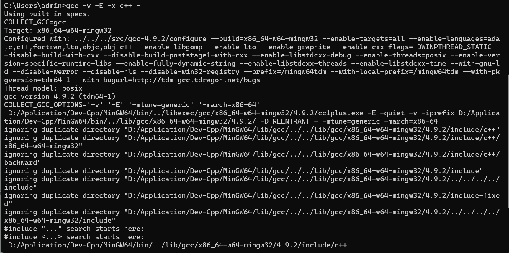
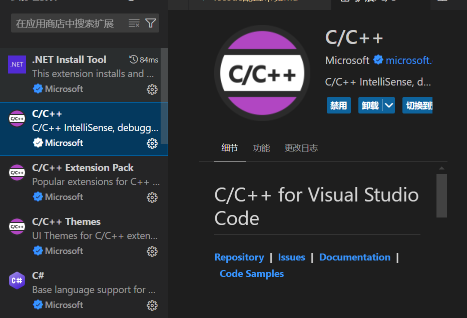
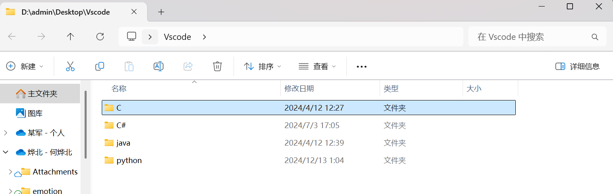
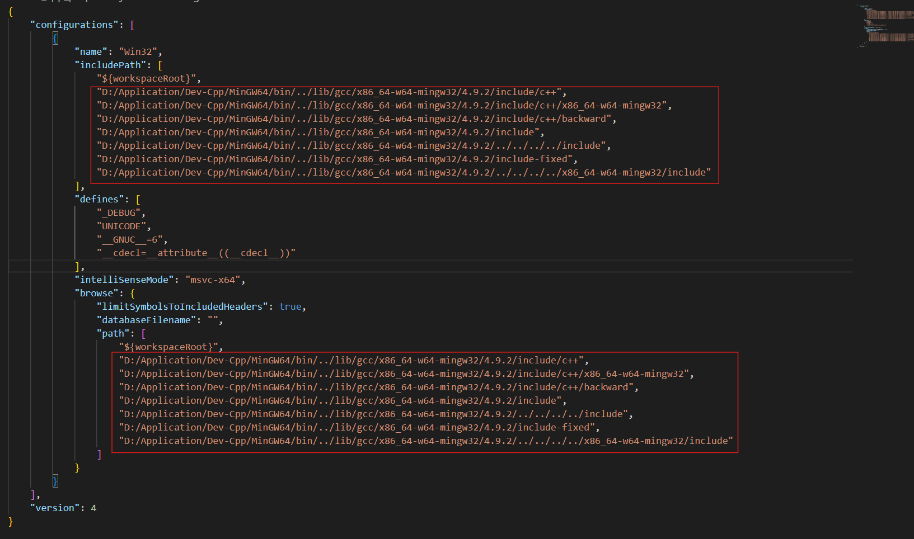
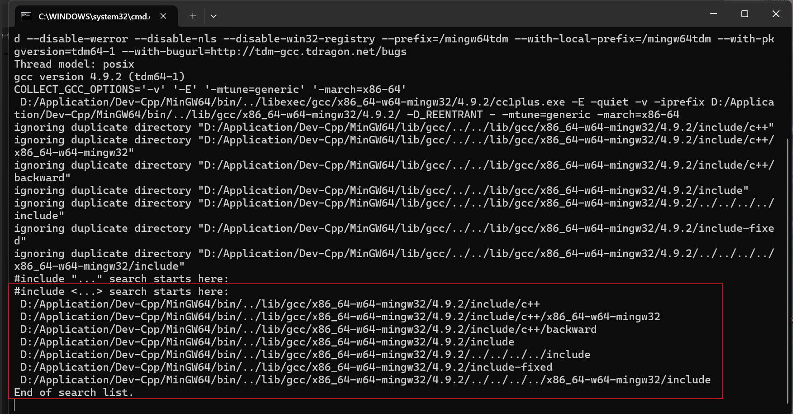
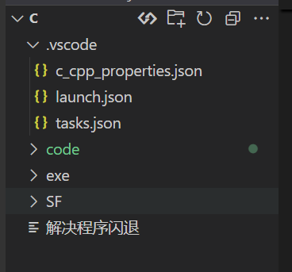

## <span id="jump1">Vscode 配置c语言环境</span>

[参考链接](https://blog.csdn.net/ren648154292/article/details/111151724)

1. 安装编译器MinGW编译器或选择调用Dev-C++软件环境

[Mingw下载地址](https://sourceforge.net/projects/mingw-w64/files/)

[Dev-C++下载地址](https://sourceforge.net/projects/orwelldevcpp/)

也可去github上下载，但需科学上网，本篇文章使用Dev-c++环境，安装时请注意软件**安装文件夹路径**，后续vscode配置以及系统环境配置需要用到。

2. 安装vscode

[vscode下载地址](https://code.visualstudio.com/)

3. 配置系统环境变量

如果使用的是Dev-C++软件环境，正确安装的话，系统环境变量会自动配置好，如果使用的是MinGW编译器，需要手动配置环境变量。可使用下面命令测试一下是否配置成功。若不成功则需要手动配置。

```cmd
gcc -v -E -x c++ -
```
如图，即为已经正确配置系统环境变量：



否则，则需要手动配置系统环境变量，步骤如下：

（1）右键点击“此电脑”->属性->高级系统设置->环境变量

（2）在系统变量中找到Path，点击新建->浏览->将Dev-编译器安装路径下的bin文件夹路径添加进去，例如："D:\Application\Dev-Cpp\MinGW64\bin"

（3）点击确定，保存修改。

最后使用命令测试一下是否配置成功。

4. 安装vscode插件

（1）在vscode中安装C/C++插件

（2）在vscode中安装Code Runner插件



5. 配置vscode

（1）新建一个文件夹，我这里新建的文件夹Vscode，然后使用vscode打开该文件夹。我这里为了后期使用vscode调用多个环境，所以选择在vscode文件夹下又新建了多个不同环境的文件夹。



（2）使用vscode打开刚刚新建的文件夹，我这里打开的是我的c文件夹。因为我配置了多个环境。

在c文件夹下新建一个.vscode文件夹，然后在该文件夹下新建三个配置文件，如下：


三个文件内容分别为：

### c_cpp_properties.json：

```
{
    "configurations": [
        {
            "name": "Win32",
            "includePath": [
                "${workspaceRoot}",
                "D:/Application/Dev-Cpp/MinGW64/bin/../lib/gcc/x86_64-w64-mingw32/4.9.2/include/c++",
                "D:/Application/Dev-Cpp/MinGW64/bin/../lib/gcc/x86_64-w64-mingw32/4.9.2/include/c++/x86_64-w64-mingw32",
                "D:/Application/Dev-Cpp/MinGW64/bin/../lib/gcc/x86_64-w64-mingw32/4.9.2/include/c++/backward",
                "D:/Application/Dev-Cpp/MinGW64/bin/../lib/gcc/x86_64-w64-mingw32/4.9.2/include",
                "D:/Application/Dev-Cpp/MinGW64/bin/../lib/gcc/x86_64-w64-mingw32/4.9.2/../../../../include",
                "D:/Application/Dev-Cpp/MinGW64/bin/../lib/gcc/x86_64-w64-mingw32/4.9.2/include-fixed",
                "D:/Application/Dev-Cpp/MinGW64/bin/../lib/gcc/x86_64-w64-mingw32/4.9.2/../../../../x86_64-w64-mingw32/include"
            ],
            "defines": [
                "_DEBUG",
                "UNICODE",
                "__GNUC__=6",
                "__cdecl=__attribute__((__cdecl__))"
            ],
            "intelliSenseMode": "msvc-x64",
            "browse": {
                "limitSymbolsToIncludedHeaders": true,
                "databaseFilename": "",
                "path": [
                    "${workspaceRoot}",
                    "D:/Application/Dev-Cpp/MinGW64/bin/../lib/gcc/x86_64-w64-mingw32/4.9.2/include/c++",
                    "D:/Application/Dev-Cpp/MinGW64/bin/../lib/gcc/x86_64-w64-mingw32/4.9.2/include/c++/x86_64-w64-mingw32",
                    "D:/Application/Dev-Cpp/MinGW64/bin/../lib/gcc/x86_64-w64-mingw32/4.9.2/include/c++/backward",
                    "D:/Application/Dev-Cpp/MinGW64/bin/../lib/gcc/x86_64-w64-mingw32/4.9.2/include",
                    "D:/Application/Dev-Cpp/MinGW64/bin/../lib/gcc/x86_64-w64-mingw32/4.9.2/../../../../include",
                    "D:/Application/Dev-Cpp/MinGW64/bin/../lib/gcc/x86_64-w64-mingw32/4.9.2/include-fixed",
                    "D:/Application/Dev-Cpp/MinGW64/bin/../lib/gcc/x86_64-w64-mingw32/4.9.2/../../../../x86_64-w64-mingw32/include"
                ]
            }
        }
    ],
    "version": 4
}
```
在这个文件中，我们需要把路径换成自己的路径，即下方方框中的路径：



这个路径可以使用上方的c环境测试命令查看到：

```cmd
gcc -v -E -x c++ -
```
也就是图中红框中的部分



注意两边格式需要匹配

----

### tasks.json：

```
{
    // See https://go.microsoft.com/fwlink/?LinkId=733558
    // for the documentation about the tasks.json format
    "version": "2.0.0",
    "tasks": [
        {
            "label": "echo",
            "type": "shell",
            "command": "g++",
            "args": [
                "-g", 
                "${file}", 
                "-o", 
                "${workspaceFolder}\\exe\\${fileBasenameNoExtension}.exe",
                "-fexec-charset=GBK",//解决中文乱码
            ]
        }
    ],
    "presentation": {
        "echo": true,
        "reveal": "always",
        "focus": false,
        "panel": "shared", 
        "showReuseMessage": true,
        "clear": true
    }
}


```
----

### launch.json：

```
{
    "version": "0.2.0",
    "configurations": [
        {
            "name": "(Windows) Launch",
            "type": "cppvsdbg",
            "request": "launch",
            "program": "cmd",
            "preLaunchTask": "echo",
            "args": [
                "/C",
                "${fileDirname}\\${fileBasenameNoExtension}.exe",
                "&",
                "echo.",
                "&",
                "pause"
            ],
            "stopAtEntry": false,
            "cwd": "${workspaceFolder}",
            "environment": [],
            "externalConsole":true
        },
        {
            "name": "(gdb) Launch",
            "type": "cppdbg",
            "request": "launch",
            "program": "${workspaceFolder}\\exe\\${fileBasenameNoExtension}.exe",
            "args": [],
            "stopAtEntry": false,
            "cwd": "${workspaceFolder}",
            "environment": [],
            "externalConsole": true,
            "MIMode": "gdb",
            "miDebuggerPath": "D:\\Application\\Dev-Cpp\\MinGW64\\bin\\gdb.exe",// 自己电脑的gdb
            "preLaunchTask": "echo",//这里和task.json的label相对应
            "setupCommands": [
                {
                    "description": "Enable pretty-printing for gdb",
                    "text": "-enable-pretty-printing",
                    "ignoreFailures": true
                }
            ]
 
        }
    ]
}
```

因为我的配置文件我进行了自定义，所以我的目录结构会有不同，我的代码，放在code中，编译生成的exe文件放在了exe文件夹中，如果不想可以寻找文件中的相关代码修改。



----